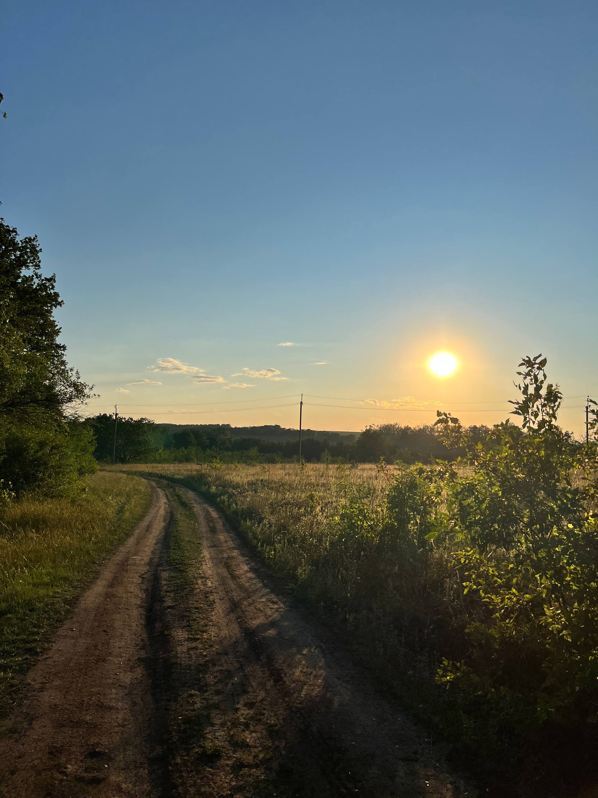

# GitHub-Intro
# Quick references

[👩‍🎓 Author](#-author) |
[📜 Description](#-description) |
[📚 My Favorite University Subjects](#-my-favorite-university-subjects) |
[🌍 Online VS Offline Studying](#-online-vs-offline-studying) |
[🔢 My Favorite Math Formulas](#-my-favorite-math-formulas) |
[💻 My coding skills](#-my-coding-skills) |
[🖼️ The image I like](#-3-the-image-i-like)


# 👩‍🎓 Author  
* **Name:** *Daria Moroz*  
* **Group:** *KN-125*  
* **Date:** *03.11.2025*  

---

# 📜 Description  
Hello! I'm Dasha and it's my first GitHub repo. Here I am practicing using this site and discovering something new for myself.

---

# 📚 My Favorite University Subjects  
My current favorite subjects are:

1. 💻 Algorithmization and Programming  
2. 🤖 Fundamentals of AI and IAD  
3. 📐 Analytical Geometry  

---

# 🌍 Online VS Offline Studying  

| 🌐 **Online Studying** | 🏫 **Offline Studying** |
|------------------------|--------------------------|
| You can study from anywhere in the world, in comfort, and in any weather conditions. | Information is learned more effectively, and you can communicate with classmates in person. |

---

# 🔢 My Favorite Math Formulas  

 ✨ 1. Quadratic Equation  
$$
x_{1,2} = \frac{-b \pm \sqrt{b^2 - 4ac}}{2a}
$$

 ✨ 2. Euler’s Formula  
$$
e^{i\pi} + 1 = 0
$$

 ✨ 3. Damped Harmonic Oscillation  
$$
x(t) = A e^{-\alpha t} \cos(\beta t + \gamma)
$$

---

# 💻 My coding skills

I am skilled enough to do some coding – here is one example:

```c++
#include <iostream>
using namespace std;

int main() {
    cout << "  ****   **** \n";
    cout << " ****** ****** \n";
    cout << "  ***********  \n";
    cout << "   *********   \n";
    cout << "    *******    \n";
    cout << "     *****     \n";
    cout << "      ***      \n";
    cout << "       *       \n";
    return 0;
}
```
The function ```main()``` is the entry point of the program — it runs first and prints a heart shape to the console.

You can test the code here:
[CPP Shell](https://cpp.sh/) 

# <3 The image I like
The picture shows a field, a sunset, and a road. It was taken this summer, and for me, it holds a lot of memories.
